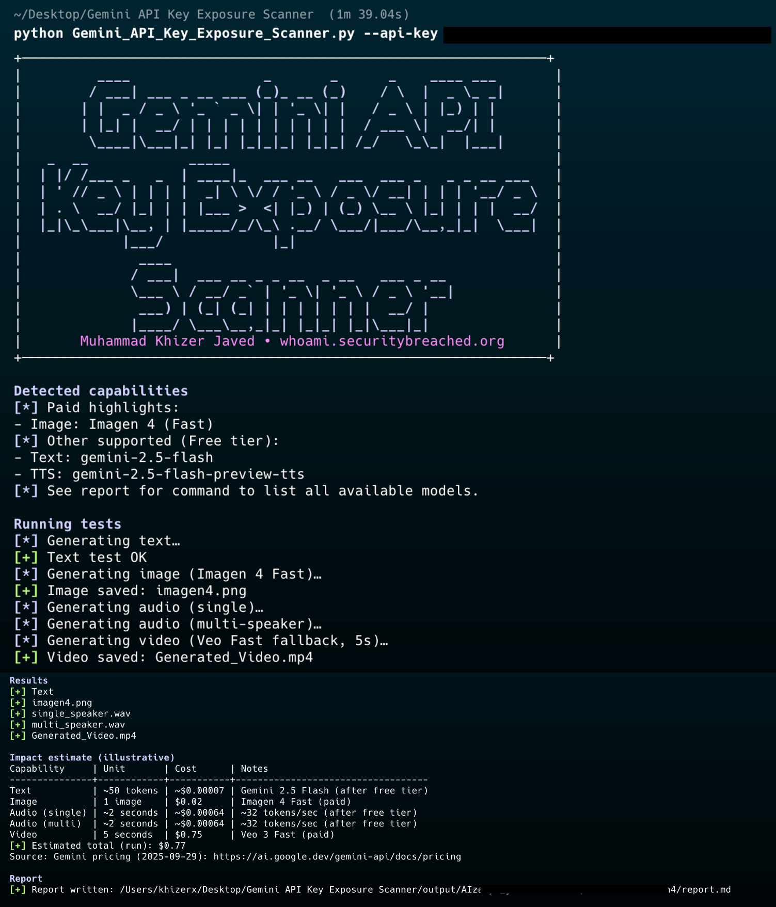

# Gemini API Key Exposure Scanner

This tool validates whether a given Google API key is accepted by Gemini-capable endpoints and identifies potentially abused capabilities (text, image via Imagen 4, video via Veo, and TTS). It runs safe, bounded probes, estimates an illustrative cost impact, and automatically generates a HackerOne/Bugcrowd-style Markdown report with PoC commands and evidence slots.

- **Main script**: `Gemini_API_Key_Exposure_Scanner.py`
- **Outputs**: `output/<YOUR_API_KEY>/` (evidence + `report.md`)

---



## What the tool does

- **Capability discovery**: Lists available Gemini models and builds a simple capability matrix from what your key can access:
  - Text: e.g., `gemini-2.5-flash` (generateContent)
  - TTS: e.g., `gemini-2.5-flash-preview-tts` (generateContent)
  - Video: Veo models (long‑running predict)
  - Image: Imagen 4 Fast (predict)
- **Safe test invocations**:
  - Text: tiny prompt to confirm acceptance
  - Image: single image attempt via Imagen 4 Fast
  - TTS: short single‑speaker and multi‑speaker samples
  - Video: 5s Veo Fast attempt with long‑running operation polling
- **Evidence collection**: Saves any generated media into the output folder.
- **Impact estimate**: Computes an illustrative USD estimate for what was actually generated in the run (details below).
- **Auto‑report**: Writes `report.md` with PoC curl commands, evidence, pricing table, and remediation steps.

---

## Installation

- Python 3.9+ recommended
- Install dependencies:
  ```bash
  pip3 install -r requirements.txt
  ```
- Optional (for audio conversion):
  - Install `ffmpeg` so PCM audio can be auto‑converted to WAV
    - Homebrew: `brew install ffmpeg`

---

## Usage

Run the scanner:
```bash
python3 Gemini_API_Key_Exposure_Scanner.py --api-key <YOUR_API_KEY>
```

If you omit `--api-key`, you’ll be prompted interactively.

### Common flags
- `--api-key <KEY>`: Google API key to test
- `--max-cost-usd <FLOAT>`: Upper bound for projected spend for this run (default: 0.50). The script uses conservative, small requests; this is an informational guardrail.
- `--no-video`: Skip Veo video test
- `--no-tts`: Skip TTS tests
- `-v, --verbose`: Verbose HTTP logs
 - `--key-file <PATH>`: Validate many keys from a file (one key per line; `#` comments and blank lines ignored)
 - `--validate`: Validation‑only mode; does not run tests and does not create any output directories

### Examples
- Minimal:
  ```bash
  python3 Gemini_API_Key_Exposure_Scanner.py --api-key AIza...redacted
  ```
- Skip video and TTS:
  ```bash
  python3 Gemini_API_Key_Exposure_Scanner.py --api-key AIza... --no-video --no-tts
  ```
- Verbose:
  ```bash
  python3 Gemini_API_Key_Exposure_Scanner.py --api-key AIza... -v
  ```

### Bulk validation (no output directories, no tests)
- Validate a single key without running tests:
  ```bash
  python3 Gemini_API_Key_Exposure_Scanner.py --api-key AIza... --validate
  ```
- Validate many keys from a file `keys.txt` (one per line):
  ```bash
  python3 Gemini_API_Key_Exposure_Scanner.py --key-file keys.txt --validate
  ```

What happens in validation mode:
- The tool calls the models listing endpoint to check acceptance.
- Results per key are printed concisely:
  - Green: `[*NOT Vulnerable*]` if Gemini is not enabled/usable for that key
  - Red: `[*Vulnerable*]` if the API key is accepted by Gemini endpoints
- No evidence generation, no tests, and no `output/<KEY>/` directories are created in this mode.

---

## Output structure

Outputs are grouped by the provided key in `output/<YOUR_API_KEY>/`:
- `imagen4.png` (if image generation succeeded)
- `single_speaker.wav` or `single_speaker.pcm` (TTS single)
- `multi_speaker.wav` or `multi_speaker.pcm` (TTS multi)
- `Generated_Video.mp4` (if Veo succeeded)
- `report.md` (auto‑generated)

If `ffmpeg` is not available, TTS audio is saved as PCM with a printed one‑liner to convert to WAV manually.

---

## How cost impact is calculated (illustrative)

The script embeds a pricing snapshot (see `PRICING` in the code) sourced from `https://ai.google.dev/gemini-api/docs/pricing`, including a `last_updated` date. For each run, it computes a simplified estimate based on actual evidence produced:

- **Text**: assumes ~50 total tokens (input+output) using `gemini-2.5-flash` rates split 50/50 input/output.
- **Image (Imagen 4 Fast)**: uses the per‑image price; counted only if an image was saved.
- **TTS**: assumes ~32 audio tokens/second; adds ~2 seconds for each produced clip (single and multi).
- **Video (Veo 3 Fast)**: uses a per‑second rate; adds 5 seconds if a video was saved.

Notes:
- This is an illustrative estimate for bug bounty impact; real billing varies by region, access, and latest pricing.
- The CLI prints a per‑capability table and total, and the same appears in the generated report.

---

## How the report is generated

After the run, a Markdown report is written to:
```
output/<YOUR_API_KEY>/report.md
```

The report includes:
- **Summary** of detected capabilities
- **PoC commands** for: listing models; text `generateContent`; Imagen 4 `predict`; Veo long‑running `predictLongRunning`; TTS single and multi
- **Evidence** section listing saved files
- **Impact and pricing** table using the embedded `PRICING` snapshot and last‑updated metadata
- **Remediation guidance** (rotate key, avoid client‑side keys, proxy with auth/rate limits/allowlists, monitor billing)

This format is tailored for security/bug bounty workflows and can be pasted directly into platforms like HackerOne & Bugcrowd.

---

## Troubleshooting

- "Imagen 4 test failed or not supported": The key may not have access to Imagen 4 or the endpoint/region is restricted.
- "TTS returned 200 but no inlineData": Some preview models/accounts return responses without inline audio; try later or verify access.
- "ffmpeg not found": Install `ffmpeg` or use the printed command to convert `.pcm` to `.wav`.
- Veo long‑running status never finishes: Video generation can fail silently; the tool stops after a bounded polling window.
